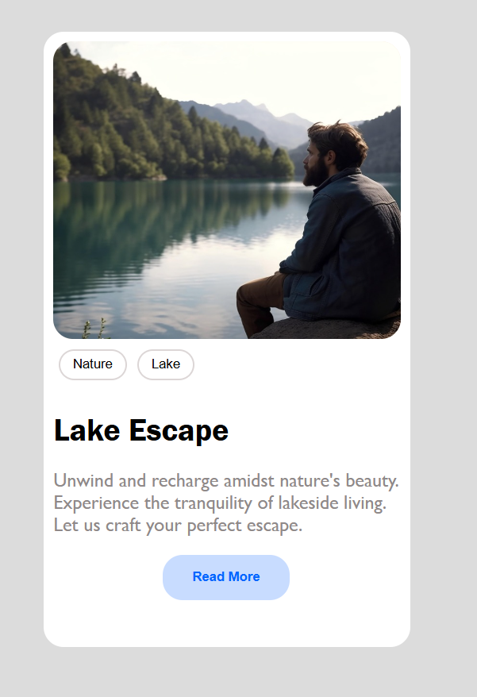

# Business Card

A simple responsive business card web page showcasing a lakeside escape theme.

## Features

- Clean, modern design
- Responsive layout
- Interactive buttons with hover effects

## Preview

## Getting Started

1. Clone or download this repository.
2. Open `index.html` in your browser.
3. To edit styles, modify [`style.css`](style.css).

## Customization

- Change the image URL in [`index.html`](index.html) for a different card photo.
- Edit button labels or text content as needed.

## Live Server

If using VS Code, you can use the Live Server extension. The recommended port is set to `5501` in [`.vscode/settings.json`](.vscode/settings.json).

---

**Made with HTML & CSS**
**Developed by Hoor Fayaz**